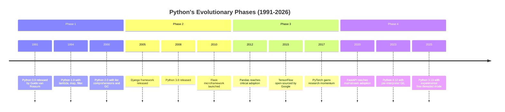
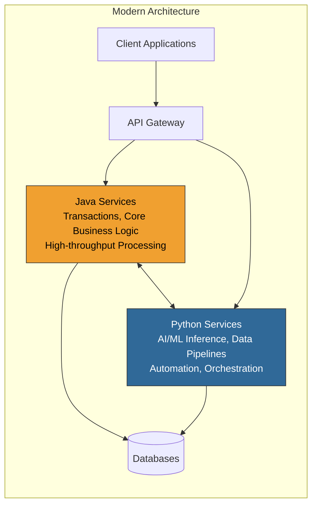

# Python at 35: Technical Evolution, Production Strengths and the Road Ahead


**DZone Zones:** Python, Architecture, Web Development
**Tags:** python, java, programming-languages, software-architecture

---

## Introduction

On February 20, 2026, Python turns 35 years old. Created by Guido van Rossum in 1991, the language has crossed boundaries that few technologies ever manage: from academic scripting tool to the dominant force behind modern artificial intelligence, cloud automation, web development and scientific computing.

That longevity is not accidental. Python survived four distinct paradigm shifts in computing --- desktop to internet, internet to cloud, cloud to mobile and mobile to AI --- by consistently optimizing for one thing above all else: developer productivity. While other languages competed on raw performance or enterprise safety, Python bet on readability, simplicity and a remarkably low barrier to entry. That bet paid off in ways that would have been difficult to predict in 1991.

But longevity alone doesn't tell the whole story. Python's position in 2026 comes with real technical trade-offs. Performance limitations, packaging fragmentation and concurrency constraints are well-documented challenges that the community is actively addressing. Understanding where Python excels and where it still needs improvement is essential for any engineer making technology decisions today.

This article traces Python's technical evolution through four phases, examines its production-grade strengths and improvement opportunities, compares it architecturally with Java (which itself turned 30 last year) and looks at what the next decade holds.

---

## Four Phases of Python's Evolution

Python's 35-year journey can be understood through four distinct phases, each representing a fundamental shift in what the language was used for and who was using it.




### Phase 1: Academic and Scripting (1991--2000)

Python emerged from a specific frustration. Guido van Rossum, working at Centrum Wiskunde & Informatica in the Netherlands, wanted a language that combined the shell scripting convenience of ABC with the system access capabilities of C. The result was a language built on several foundational design choices that still define Python today.

**Dynamic typing** made Python approachable. Variables didn't require type declarations, which eliminated an entire category of boilerplate that dominated C and early Java code. **Indentation-based syntax** enforced readability as a structural requirement rather than a style preference. The **"batteries included" standard library** meant that common tasks --- file I/O, string manipulation, networking --- worked out of the box without external dependencies.

During this phase, Python was primarily a teaching language and a scripting tool for Unix system administrators. It was not yet considered a production-grade technology by most enterprise teams. Its identity was clear: **a better scripting language**.

### Phase 2: Web Expansion (2000--2010)

Python 2.0 in 2000 introduced list comprehensions and a cycle-detecting garbage collector, signaling a transition from scripting tool to general-purpose language. But the real transformation came through web frameworks.

Django, released in 2005, gave Python a full-featured web framework that could compete with Java's Spring and Ruby on Rails. Its "batteries included" philosophy mirrored Python's own standard library approach, providing ORM, authentication, admin interfaces and URL routing in a single cohesive package. Flask followed in 2010, offering a minimalist alternative that appealed to developers who wanted more architectural control.

This era also saw Python become deeply embedded in the Linux ecosystem. Package managers, system utilities and configuration management tools (Ansible, SaltStack) were increasingly written in Python, cementing its role in infrastructure operations.

The Python 2 to Python 3 transition, beginning with Python 3.0 in 2008, was one of the most difficult community migrations in programming language history. The decision to break backward compatibility --- particularly around Unicode string handling --- created a schism that took nearly a decade to fully resolve. Python 2 reached end of life in January 2020.

During this phase, Python's identity shifted: **a web productivity language**.

### Phase 3: Data Science Revolution (2010--2020)

The third phase is where Python's trajectory diverged dramatically from nearly every other scripting language. A convergence of libraries transformed Python into the default language for scientific computing and machine learning.

**NumPy** provided efficient numerical arrays with C-level performance. **Pandas** built tabular data manipulation on top of NumPy, giving data analysts a tool that rivaled R for statistical work. **SciPy** added scientific computing algorithms. **Jupyter Notebooks** created an interactive computing environment that became the standard interface for data exploration across industry and academia.

Then came the deep learning frameworks. **TensorFlow**, open-sourced by Google in 2015, chose Python as its primary interface language. **PyTorch**, released by Meta's AI Research lab, followed the same path. This was not coincidental --- Python's dynamic nature made it ideal for the experimental, iterative workflow that machine learning research demands.

The result was a self-reinforcing cycle: researchers published in Python, students learned in Python, companies hired Python developers for data teams and framework authors continued building for Python.

Python's identity solidified: **the language of data and AI**.

### Phase 4: Platform and Cloud (2020--Present)

The current phase extends Python's reach into areas that were historically dominated by Java, Go and Node.js.

**FastAPI**, which reached mainstream adoption around 2020, demonstrated that Python could deliver high-performance async web services with automatic OpenAPI documentation and type-validated request handling. Built on Starlette and Pydantic, FastAPI brought modern API development patterns to Python without sacrificing the language's characteristic simplicity.

Cloud automation became another growth area. AWS Lambda, Google Cloud Functions and Azure Functions all offer first-class Python support. Infrastructure-as-code tools like Pulumi provide Python SDKs alongside their TypeScript and Go options. DevOps pipelines increasingly use Python for orchestration logic.

Perhaps most significantly, the current AI wave --- large language models, retrieval-augmented generation, agent frameworks --- runs almost entirely on Python infrastructure. Libraries like LangChain, LlamaIndex and Hugging Face Transformers are Python-first, reinforcing the language's position at the center of AI development.

Python's current identity: **the universal integration language**.

---

## Technical Strengths That Matter in Production

Python's widespread adoption is not simply about popularity. It reflects specific technical characteristics that deliver measurable value in production environments.

### Developer Productivity

Python consistently enables faster development cycles than statically typed alternatives. The combination of concise syntax, dynamic typing and a rich standard library reduces the amount of code required to express business logic. For teams operating under time-to-market pressure, this translates directly into competitive advantage.

### AI and Machine Learning Dominance

Python's position in AI is not just strong --- it is effectively unchallenged. The entire modern ML stack, from data preprocessing to model training to inference serving, is built around Python interfaces. Even when the underlying computation happens in C++ or CUDA, the orchestration layer is Python. This isn't changing anytime soon.

### Massive Ecosystem

The Python Package Index (PyPI) hosts hundreds of thousands of packages covering virtually every domain: web development, data processing, network programming, image manipulation, cryptography, testing and more. This ecosystem breadth means that most problems have existing solutions, reducing the need to build from scratch.

### Cross-Domain Applicability

Few languages can credibly claim relevance across web backends, data science, systems automation, embedded computing, game scripting and scientific research. Python's cross-domain reach means that organizations can standardize on a single language for diverse technical needs, reducing hiring complexity and enabling knowledge transfer between teams.

### Prototyping Speed

Python's interactive nature --- particularly through Jupyter Notebooks and the REPL --- makes it exceptionally effective for rapid prototyping and exploratory work. Ideas can be tested and validated before committing to production implementations, whether those final implementations stay in Python or move to a compiled language.

### Orchestration Capabilities

Modern architectures increasingly need a "glue" layer that coordinates between services, APIs, databases and external systems. Python excels in this orchestration role, with strong HTTP client libraries, database connectors, message queue integrations and cloud SDKs.

---

## Technical Opportunities for Improvement

An honest assessment of Python at 35 must acknowledge the areas where the language faces genuine technical challenges.

### Performance

Python remains significantly slower than compiled languages for CPU-bound workloads. The Global Interpreter Lock (GIL) has historically prevented true parallel execution of Python threads. While CPython 3.13 introduced an experimental free-threaded mode, and JIT compilation is under active development, Python's runtime performance is a real constraint for latency-sensitive applications.

Memory consumption is another factor. Python objects carry substantial overhead compared to equivalent structures in C, Go or Rust. For applications processing large volumes of data in memory, this overhead can be significant.

### Packaging Complexity

The Python packaging ecosystem has improved considerably, but fragmentation persists. Teams must choose between pip, Poetry, uv, conda and other tools, each with different dependency resolution strategies, lock file formats and virtual environment approaches. The lack of a single blessed workflow creates friction, particularly for new Python developers and for organizations trying to standardize their toolchains.

The emergence of **uv** (from the Astral team) represents a promising step toward simplification, offering dramatically faster package resolution with a unified interface. But the ecosystem still carries the complexity of its history.

### Concurrency Limitations

While asyncio provides cooperative concurrency for I/O-bound workloads, Python's story for CPU-bound parallelism has been historically weak. The multiprocessing module works but introduces serialization overhead. Subinterpreters, introduced experimentally in Python 3.12, offer a path toward true parallelism without the GIL, but the API is still maturing.

The free-threaded (no-GIL) build in Python 3.13 is the most ambitious concurrency improvement in Python's history, but it comes with compatibility trade-offs. Many C extensions assume the GIL exists, and updating the entire ecosystem will take years.

### Enterprise Governance

Dynamic typing offers productivity advantages, but it introduces risks at scale. Large codebases without type annotations become difficult to refactor safely. Python's gradual typing system (type hints with mypy, Pyright or pytype) provides a path forward, but adoption varies widely across the ecosystem.

Runtime errors that would be caught at compile time in Java or Go remain a reality in Python. Disciplined teams mitigate this with comprehensive testing and strict linting, but the language itself does not enforce these practices.

---

## Python vs Java: A Technical Comparison

Python at 35 and Java at 30 represent two fundamentally different philosophies of software engineering that, in modern systems, are increasingly complementary rather than competitive.




### Technical Dimensions

| Dimension | Python | Java |
|---|---|---|
| **Optimization target** | Developer speed | System stability |
| **Typing system** | Dynamic with gradual typing | Static with type inference |
| **Performance** | Moderate (improving) | High (JVM optimized) |
| **Enterprise safety** | Discipline-dependent | Built into language design |
| **AI leadership** | Dominant | Minimal |
| **Tooling maturity** | Evolving rapidly | Extremely mature |
| **Concurrency model** | Async I/O, limited parallelism | Virtual threads, mature parallelism |
| **Innovation speed** | Very high | Controlled and deliberate |

### Where Each Language Leads

Java remains the backbone of enterprise infrastructure. Banking systems, telecom platforms, government services and large-scale transactional systems rely on the JVM's predictability, backward compatibility guarantees and battle-tested concurrency model. Project Loom's virtual threads (introduced in Java 21) have modernized Java's concurrency story without breaking existing code.

Python leads in intelligence and experimentation. Machine learning pipelines, data analytics platforms, AI agent systems and rapid prototyping workflows are overwhelmingly Python-first. The language's flexibility and ecosystem depth make it the natural choice for work where iteration speed matters more than runtime performance.

### Architectural Reality

The most important insight is that modern systems don't choose between Python and Java --- they combine both. Java handles the transactional backbone: payment processing, order management, user authentication at scale. Python handles the intelligence layer: recommendation engines, fraud detection models, automated data pipelines, AI-powered features.

This isn't a theoretical pattern. It is the standard architecture at most technology companies operating at scale. The two languages occupy different optimization layers, which is precisely why both continue growing decades after their creation.

---

## Code Examples: Python's Evolution in Practice

Python's evolution is visible in how the same concepts are expressed across different eras of the language.

### Data Modeling: Then and Now

```python
# 2005-era Python 2 style
class User:
    def __init__(self, name, email):
        self.name = name
        self.email = email

    def __repr__(self):
        return "User(name=%s, email=%s)" % (self.name, self.email)

    def __eq__(self, other):
        return self.name == other.name and self.email == other.email
```

```python
# Modern Python (3.10+) with dataclasses
from dataclasses import dataclass

@dataclass
class User:
    name: str
    email: str
```

The modern version delivers the same functionality --- `__init__`, `__repr__`, `__eq__` and more --- in four lines. Type annotations serve as both documentation and tooling input for static analyzers.

### String Formatting Evolution

```python
# Python 2 style
message = "Hello %s, you have %d messages" % (name, count)

# Python 3 str.format()
message = "Hello {}, you have {} messages".format(name, count)

# Modern f-strings (Python 3.6+)
message = f"Hello {name}, you have {count} messages"
```

### Web Services: CGI to FastAPI

```python
# Early 2000s: CGI script
import cgi
print("Content-Type: application/json")
print()
print('{"status": "ok"}')
```

```python
# 2010s: Flask
from flask import Flask, jsonify

app = Flask(__name__)

@app.route("/health")
def health():
    return jsonify(status="healthy")
```

```python
# 2020s: FastAPI with async and type validation
from fastapi import FastAPI

app = FastAPI()

@app.get("/health")
async def health():
    return {"status": "healthy", "language": "Python", "age": 35}
```

The progression shows Python absorbing modern patterns --- async/await, type hints, automatic documentation --- without abandoning its core simplicity.

### Pattern Matching (Python 3.10+)

```python
# Structural pattern matching, introduced in Python 3.10
def handle_command(command: dict) -> str:
    match command:
        case {"action": "create", "resource": resource}:
            return f"Creating {resource}"
        case {"action": "delete", "resource": resource, "force": True}:
            return f"Force deleting {resource}"
        case {"action": "delete", "resource": resource}:
            return f"Deleting {resource} (safe mode)"
        case _:
            return "Unknown command"
```

This feature, inspired by pattern matching in Rust and Scala, demonstrates Python's willingness to adopt powerful constructs from other language traditions while maintaining its characteristic readability.

---

## Future Outlook

### Python's Next Decade

Several technical trajectories will shape Python's evolution over the coming years.

**Performance improvements** are the highest priority. The free-threaded (no-GIL) build, JIT compilation experiments and continued work on faster CPython releases represent a sustained effort to close the performance gap with compiled languages. The goal is not to match C or Rust in raw speed but to reduce the gap enough that performance alone is rarely a reason to choose a different language.

**Gradual typing normalization** will continue. As codebases grow and teams scale, type annotations are moving from optional nice-to-have to expected practice. Tools like mypy, Pyright and pytype are improving rapidly, and frameworks like FastAPI and Pydantic have demonstrated that type hints can enhance rather than hinder the developer experience.

**Packaging standardization** is underway. The uv project and ongoing PEP discussions around dependency management suggest that the ecosystem is converging toward simpler, faster tooling. This won't happen overnight, but the direction is clear.

**AI-native integration** will deepen. As AI capabilities become embedded in more applications, Python's role as the orchestration layer for AI systems will expand. Agent frameworks, retrieval-augmented generation pipelines and multimodal AI systems are all being built Python-first.

### Java's Parallel Evolution

Java is not standing still. Project Loom (virtual threads), Project Panama (foreign function access), Project Valhalla (value types) and the accelerated six-month release cadence are modernizing the platform while preserving its stability guarantees. Java's strength --- and its strategic position --- lies in being the infrastructure backbone that Python intelligence layers can rely on.

### Convergence, Not Replacement

The future of enterprise software architecture is not about Python replacing Java or Java absorbing Python's strengths. It is about both languages occupying complementary layers in increasingly sophisticated systems. Java provides the transactional reliability and throughput that business-critical operations demand. Python provides the flexibility and ecosystem depth that AI, analytics and automation require.

Organizations that understand this complementary relationship --- and build architectures that leverage both --- will have a structural advantage over those still debating which single language to standardize on.

---

## Conclusion

Thirty-five years is an extraordinary lifespan for a programming language. Most languages peak within a decade and fade into niche usage within two. Python has not only survived --- it has accelerated, finding new relevance with each paradigm shift in computing.

That success rests on a consistent design philosophy: optimize for the human, not the machine. Make code readable. Keep the barrier to entry low. Provide a rich standard library. Welcome newcomers. These principles, established by Guido van Rossum in 1991, continue to guide the language's evolution in 2026.

But Python's future is not guaranteed by its past. The community must continue addressing performance limitations, packaging complexity and enterprise governance challenges. The no-GIL initiative, JIT compilation work, uv packaging tool and gradual typing adoption are all steps in the right direction.

What is clear is that Python at 35 occupies a position in the software industry that no other language can easily replicate. It is the bridge between domains --- connecting data scientists with web developers, researchers with production engineers, AI models with business applications. That bridging capability, more than any single technical feature, is what makes Python enduring.

Happy 35th birthday, Python. The road ahead looks as interesting as the road behind.

---

**Author:** [Wallace Espindola](https://www.linkedin.com/in/wallaceespindola/)
**GitHub:** [github.com/wallaceespindola](https://github.com/wallaceespindola/)
**Published:** February 20, 2026
