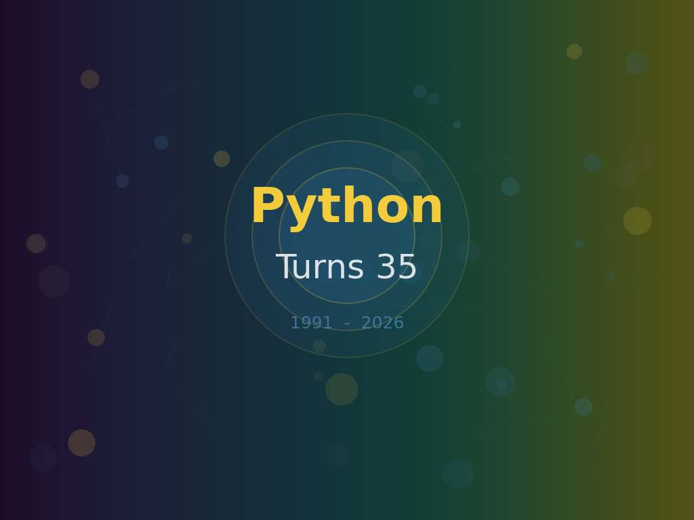
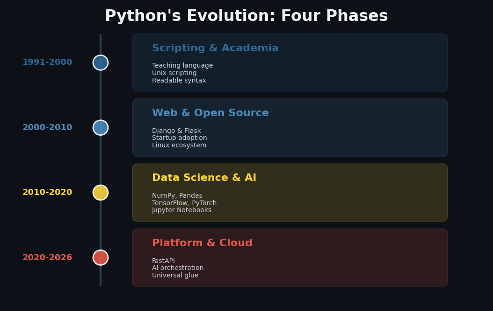
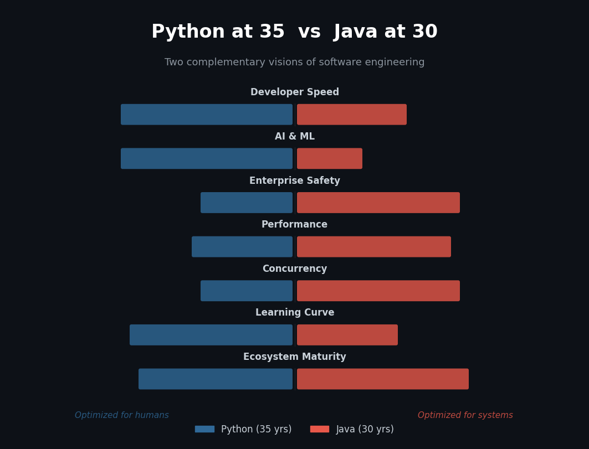

# Python at 35: What Surviving Five Paradigm Shifts Tells Us About Software

**Preview:** *The language that chose humans over machines*

---

Today is February 20, 2026. Thirty-five years ago, on this exact date, Guido van Rossum released version 0.9.0 of a programming language he'd been tinkering with over a Christmas holiday. He named it after Monty Python's Flying Circus, not after the snake, because he wanted programming to feel playful. That small decision tells you everything you need to know about why Python is still here and why so many of its contemporaries are not.

I've been thinking about this anniversary all week. Not because round numbers matter to compilers. They don't. But because the story of Python surviving thirty-five years of relentless technological change is one of the most instructive stories in all of software engineering. It's a story about what happens when you design for people first.

Let me put it plainly: Python has outlasted the rise and fall of desktop computing, the birth of the web, the mobile revolution, the big data era, the cloud migration and now the AI explosion. It wasn't built for any of those things. And yet here it is, more relevant than ever, powering everything from Instagram's backend to the models generating this era's most heated debates about intelligence and creativity.

How does a language do that? How does a hobby project from 1991 become the world's most popular programming language in 2026? That's the question I want to sit with today.

---

## A Language Born Out of Frustration

The origin story matters because it sets the tone for everything that followed. Guido van Rossum was working at Centrum Wiskunde & Informatica (CWI) in Amsterdam, and he was frustrated. He was using a language called ABC, which had good ideas about readability but was rigid and hard to extend. He was also writing shell scripts in C, which was powerful but punishing. He wanted something in the middle. Something that respected the programmer's time. Something where the code you wrote on Monday would still make sense on Friday.

So he built Python as a bridge. A scripting language with the readability of ABC and the extensibility of C. In those early years, roughly 1991 to 2000, Python lived a quiet life. It was a teaching tool in universities. It was a glue language on Unix systems. It was the thing you reached for when Perl felt too cryptic and C felt too heavy for the job at hand. Adoption was organic and unhurried. There was no venture capital behind it, no corporate sponsor, no marketing budget. Just a growing community of people who kept telling their friends: "You should try this. It's nice."

That word, *nice*, doesn't get enough credit in programming language design. We obsess over type systems and runtime performance and concurrency models. And those things matter. But "nice" is what gets a language adopted by the next generation of programmers. "Nice" is what makes someone choose to learn Python on a Saturday afternoon instead of dreading it. Guido understood that from day one.

## Finding Its Production Legs

The second act of Python's life started around 2000, when the web ate everything. This was the era when startups needed to ship fast and iterate faster. PHP was the dominant web language, Java was the enterprise darling and Ruby was about to have its moment with Rails. Python could have faded into the background here. A lot of scripting languages did.

Instead, it found its footing. Django arrived in 2005, giving Python a full-featured web framework that could compete with Rails. Flask followed later, offering something lighter and more composable. Google adopted Python internally and gave it enormous credibility. YouTube was built on Python. Reddit was built on Python. Dropbox was built on Python. These weren't toy projects. These were services handling millions of users, and they proved that Python could do real work in production.

But what's interesting about this period isn't just that Python survived the web era. It's *how* it survived. It didn't try to be the fastest language. It didn't try to be the most feature-rich. It just kept being the language where you could write clear, maintainable code quickly. The language that respected the person sitting at the keyboard. That philosophy, which the community eventually codified in the Zen of Python ("readability counts," "simple is better than complex"), became its competitive moat.

## The Explosion Nobody Predicted

Then came the third act, and this is where the story gets wild. Around 2010, something shifted in the technology landscape. Data started accumulating faster than anyone could process it. Machine learning went from an academic curiosity to a business necessity. And Python, quiet, readable, "just a scripting language" Python, turned out to be exactly what the data science revolution needed.

The reasons were partly technical and partly social. NumPy and SciPy had been maturing since the early 2000s, giving Python serious numerical computing capabilities. Pandas arrived and made tabular data manipulation feel almost conversational. Then Jupyter Notebooks created an interactive environment where scientists could mix code, visualization and narrative in a single document. And when the deep learning wave hit, TensorFlow in 2015, PyTorch in 2016, both frameworks chose Python as their primary interface.

This wasn't inevitable. R was the dominant language in statistics. MATLAB owned engineering. Julia was being designed specifically for scientific computing with performance as a first-class concern. Any of them could have become the language of AI. But Python won because it had something none of them could match: a massive existing ecosystem and a gentle learning curve. A biologist who'd learned Python to automate file processing could start training neural networks without switching languages. A web developer who'd built a Django app could start exploring data pipelines without learning a new syntax. Python was already *everywhere*, and that ubiquity compounded.

This is the phase that transformed Python from a popular language into a cultural phenomenon. It went from being a tool programmers chose to being a skill that hiring managers required. From a language with a community to a language with an economy.

## The Universal Glue

Which brings us to today, the fourth act. In 2026, Python isn't just a language for writing applications. It's a *platform language*. It's the glue that connects AI models to web services to cloud infrastructure to data pipelines. FastAPI has modernized its web story with async support and automatic documentation. LangChain and similar frameworks have made Python the default orchestration layer for AI applications. Infrastructure-as-code tools like Ansible and SaltStack lean on Python. Even DevOps, a domain you'd expect to be dominated by Go and Bash, has a deep Python footprint.

The pattern is clear. Every time a new technological wave arrives, Python doesn't try to be the best tool *within* that wave. It becomes the best tool *between* waves. The connector. The translator. The language you use to make different systems talk to each other. And in a world where every application is a distributed system stitched together from a dozen services, that role has never been more valuable.

---

## The Secret: Choosing Humans Over Machines

So why did Python survive when so many languages didn't? I think it comes down to a single design decision that Guido made at the very beginning and that the community has upheld ever since: **Python optimizes for the human reading the code, not for the machine running it.**

This sounds obvious. It isn't. Most language designers optimize for expressiveness or for performance or for correctness or for some theoretical elegance that looks beautiful in a paper and miserable in a codebase. Python optimized for the developer's cognitive load. It chose indentation over braces not because it was technically superior but because it was visually cleaner. It chose one obvious way to do things over Perl's "there's more than one way to do it" philosophy. It chose English-like keywords (`not`, `and`, `or`, `in`) over symbolic operators wherever it could.

These choices cost Python something. The language is slower than C, less concurrent than Go, less type-safe than Rust, less expressive than Haskell. If you're benchmarking languages on any single technical axis, Python rarely wins. But programming isn't a single-axis activity. It's a human activity performed by teams over years, and on *that* axis, the axis of sustained human productivity, Python is remarkably competitive.

---

## Let's Be Honest About the Rough Edges

I don't want to write a birthday card. I want to write an honest assessment. And honestly, Python has real problems that the community needs to keep addressing.

**Performance** remains the elephant in the room. Yes, Python 3.11 and 3.12 brought meaningful speed improvements. Yes, projects like Mojo and Cython and PyPy offer escape hatches. But the baseline interpreter is still slow by modern standards, and in a world where every API call costs money and every millisecond of latency costs users, "just call C from Python" isn't always a satisfying answer.

**Packaging and dependency management** have been a mess for years. pip, pipenv, poetry, conda, uv, the proliferation of tools is itself evidence that no single solution has cracked the problem. The JavaScript ecosystem solved this (mostly) with npm. Rust solved it with cargo. Python is still arguing about it, and newcomers still stumble through confusing virtual environment setups that make them wonder if they chose the right language.

**The GIL**, the Global Interpreter Lock, has been Python's most discussed limitation for over a decade. PEP 703 and the free-threaded builds in Python 3.13 are promising, but the transition will take years and the ecosystem impact is still uncertain.

**Type safety** is improving but still optional, which creates an awkward middle ground in large codebases. You can use type hints, and tools like mypy will check them, but the runtime ignores them entirely. For enterprise-scale projects with hundreds of developers, this can be a real source of bugs and friction.

None of these problems are fatal. But they're real, and pretending otherwise doesn't serve the community.

---

## The Java Parallel

Here's where I want to make a connection that I think is underappreciated. Java turned 30 last year. Python turns 35 today. Both languages have survived multiple paradigm shifts. Both have enormous ecosystems. Both are regularly declared "dying" by people who confuse novelty with relevance. And yet they're both thriving.

But they thrive for opposite reasons. Java optimized for the machine and the institution. Strong typing, explicit architecture, compile-time safety, enterprise-grade concurrency with virtual threads. Java is the language you choose when you need a system that will run reliably for ten years with a rotating team of fifty developers. Python optimized for the person and the problem. Dynamic typing, rapid prototyping, minimal boilerplate, instant feedback loops. Python is the language you choose when you need to explore an idea, ship a prototype or automate a workflow before lunch.

Here's what I find fascinating: modern software architectures increasingly use *both*. The AI model is trained and served with Python. The backend business logic runs on Java (or Go or Rust). The data pipeline is orchestrated in Python. The payment processing system is built in Java. This isn't a contradiction. It's *complementary specialization*. And it's actually healthy.

The industry spent years engaged in language wars, as if choosing Python meant rejecting Java, or vice versa. That framing was always wrong. The right question was never "which language is best?" It was "which language is best *for this particular problem, with this particular team, at this particular stage of the product*?" And the answer is almost always: more than one.

---

## What This Tells Us About the Future

Python's thirty-five-year arc teaches us something important about the future of programming languages. The languages that endure aren't the ones that are fastest or most innovative or most theoretically pure. They're the ones that build the largest communities of people who genuinely enjoy using them. They're the ones that lower the barrier to entry without raising the ceiling on what's possible. They're the ones that adapt to new paradigms without abandoning the people who loved them in the old ones.

Python didn't survive by being better than every alternative. It survived by being *good enough* at almost everything and *excellent* at the thing that matters most: making programming feel accessible. Making it feel like something you could sit down and do, even if you weren't a computer scientist. Even if you were a biologist or a journalist or a twelve-year-old kid who just wanted to make a game.

That accessibility is Python's greatest achievement and its most important legacy. In a world where software is eating everything and everyone needs some degree of computational literacy, a language that welcomes beginners while still serving professionals isn't just useful. It's essential.

---

## A Birthday Wish

So happy birthday, Python. You're thirty-five. You're slower than you should be, your packaging story is still a work in progress and your type system makes enterprise architects nervous. But you taught a generation of scientists to code. You powered the AI revolution. You proved that a programming language could be both serious and humane.

Not bad for a hobby project named after a comedy troupe.

Here's to the next thirty-five years. I suspect they'll be just as unpredictable as the first.

---

*What's your Python story? When did you first use it, and what keeps you coming back? Hit reply, I read every response and I'd love to hear how Python fits into your work.*

---

**About the author:** Wallace Espindola is a software engineer, technical leader and open-source contributor. Connect on [LinkedIn](https://www.linkedin.com/in/wallaceespindola/) or explore more on [GitHub](https://github.com/wallaceespindola/).
